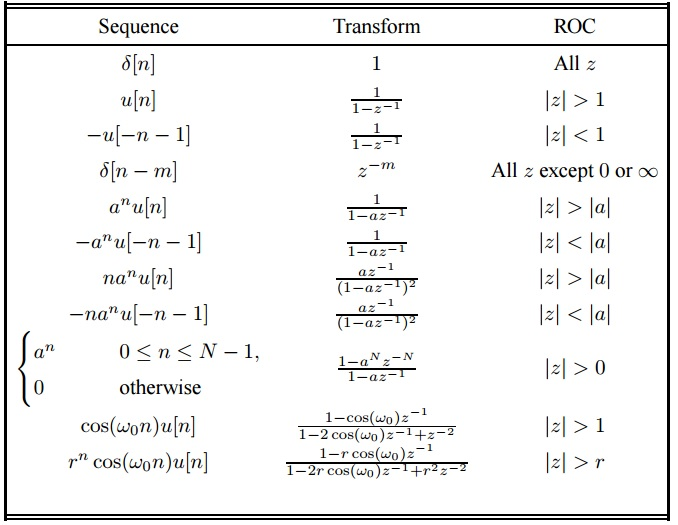

# Chapter III: The Z Transform

## III.1 Introducing the Z transform

### Preliminaries: complex numbers

* real and imaginary part
* **modulus and phase**
* graphical interpretation
* Euler formula
* modulus and phase of $e^{jx}$

### Definition of Z transform

* The Z Transform of a signal $x[n]$, called $X(z)$, is defined as:
$$X(z) = \sum_{-\infty}^\infty x[n] z^{-n}$$

* It is defined only for the values of $z$ where the sum is finite
(called *region of convergence)*

* Notation:
$$\mathcal{Z}\left( x[n] \right) = X(Z)$$
$$x[n] \trZ X(Z)$$

* Similar to the Laplace transform for analog signals

* The Z transform associates **a polynomial** to a signal (think Decision and Estimation class)
* Why?
    * Convolution of two signals = multiplication of polynomials
    * Short descriptions of complicated signals (i.e. exponential signals)

### Examples

$x[n] = {1, 2, 5, 7, 0}$, (with time origin in 1 or in 5)

$\delta[n]$, $\delta[n-k]$, $\delta[n+k]$

$\left(\frac{1}{2}\right)^n$

$x[n] = a^n u[n]$

$x[n] = -a^n u[-n-1]$

### Region of convergence

* For finite-support signals, the CR is the whole Z plane, possibly except 0 or $\infty$

* For causal signals, the CR is *the outside of a circle*:
$$|z| > r_1$$

* For anti-causal signals, the CR is *the inside of a circle*:
$$|z| < r_2$$

* For bilateral signals, both the causal and the anti-causal terms of the sum must converges ---> the CR is the area between two circles:
$$r_1 < |z| < r_2$$

* For finite-support signals, the two "circles" are $0$ and $\infty$

* Two different signals can have the same expression of $X(z)$, but with different RC!
    * RC is an essential part in specifying a Z transform
    * should never be omitted

### The Inverse Z Transform

* From a purely mathematical point of view, $X(z)$ is a complex function
* Proper definition of inverse transform is based on the theory of complex functions

$$X(z) = \sum_{-\infty}^\infty x[k] z^{-k}$$

* Multiply with $z^{n-1}$ and integrate along a contour C inside the Convergence Region:

$$\oint_C X(z) z^{n-1} dz = \oint_C \sum_{-\infty}^\infty x[k] z^{n-k-1} dz = \sum_{-\infty}^\infty x[k] \oint_C z^{n-k-1} dz$$

### The Inverse Z Transform

* The Cauchy integral theorem says that:
$$ \frac{1}{2 \pi j} \oint_C z^{n-k-1} dz= 
\begin{cases}
1, &\mbox{if } k = n \\
0, &\mbox{if } k \neq n
\end{cases}
$$
 * And therefore:
$$x[n] = \frac{1}{2 \pi j} \oint_C X(z) z^{n-1} dz$$

* We will not use this relation in practice, but instead will rely on **partial fraction decomposition**

### Properties of Z transform

#### 1. Linearity

If $x_1[n] \trZ X_1(z)$ with CR1, and $x_2[n] \trZ X_2(z)$ with CR2, then:
$$a x_1[n] + b x_2[n] \trZ a X_1(z) + b X_2(z)$$
and CR is at least the intersection of CR1 and CR2.

Proof: use definition

### Properties of Z transform
#### 2. Shifting in time

If $x[n] \trZ X(z)$ with CR, then:
$$x[n-k] \trZ z^{-k} X(z)$$
with same RC, possibly except $0$ and $\infty$.

Proof: by definition

* valid for all $k$, also for $k < 0$
* delay of 1 sample = $z^{-1}$

### Properties of Z transform
#### 3. Modulation in time

If $x[n] \trZ X(z)$ with CR, then:
$$ e^{j \omega_0 n} x[n] \trZ X \left(e^{- j\omega_0}z \right)$$
with same CR

Proof: by definition

### Properties of Z transform
#### 4. Reflected signal

If $x[n] \trZ X(z)$ with CR $r_1 < |z| < r_2$, then:
$$ x[-n] \trZ X \left( z^{-1} \right)$$
with CR $\frac{1}{r_2} < |z| \frac{1}{r_1}$

Proof: by definition

### Properties of Z transform
#### 5. Derivative of Z transform

If $x[n] \trZ X(z)$ with CR, then:
$$ n x[n] \trZ \frac{dX \left( z \right)}{dz}$$
with same CR

Proof: by derivating the difference

### Properties of Z transform
#### 6. Transform of difference

If $x[n] \trZ X(z)$ with CR, then:
$$ x[n] - x[n-1] \trZ (1-z^{-1}) X(z)$$
with same CR except $z=0$.

Proof: using linearity and time-shift property

### Properties of Z transform
#### 7. Accumulation in time

If $x[n] \trZ X(z)$ with CR, then:
$$ y[n] = \sum_{k=-\infty}^{n} x[k] \trZ \frac{X(z)}{(1-z^{-1})}$$
with same CR except $z=1$.

Proof: $x[n] = y[n] - y[n-1]$, apply previous property

### Properties of Z transform
#### 8. Complex conjugation

If $x[n] \trZ X(z)$ with CR, and $x[n]$ is a complex signal, then:
$$ x^*[n] \trZ X^* \left( z^* \right)$$
with same CR except $z=0$.

Proof: apply definition

### Properties of Z transform
#### 9. Convolution in time

If $x_1[n] \trZ X_1(z)$ with CR1, 
and $x_2[n] \trZ X_2(z)$ with CR2, then:
$$ x[n] = x_1[n] * x_2[n] \trZ X(z) = X_1(z) \cdot X_2(z)$$
and CR the intersection of CR1 and CR2.

Proof: use definition

* **Very important property!**
* Can compute the convolution of two signals via the Z transform

### Properties of Z transform
#### 10. Correlation in time

If $x_1[n] \trZ X_1(z)$ with CR1, 
and $x_2[n] \trZ X_2(z)$ with CR2, then:
$$ r_{x_1x_2}[l] = \sum_{n=-\infty}^{\infty} x_1[n] x_2[n-l] \trZ R_{x_1 x_2}(z) = X_1(z) \cdot X_2(z^{-1})$$
and CR the intersection of CR1 and with the CR of $X_2(z^{-1})$ (see reflection property)

Proof: correlation  = convolution with second signal reflected, use convolution and reflection properties

### Properties of Z transform
#### 11. Initial value theorem

If $x[n]$ is a causal signal, then

$$ x[0] = \lim_{z \to \infty}X(z)$$

Proof: 
$$X(z) = \sum_{n=0}^{\infty} x[n] z^{-n} = x[0] + x[1]z^{-1} + x[2]z^{-2} + ...$$
When $z \to \infty$, all terms $z^{-k}$ vanish.

### Common Z transform pairs

* Easily found all over the Internet

## III.2. Z transforms which are Rational Functions

### Rational functions

* Many Z transforms are in the form of a rational function, i.e.
a fraction where
    * numerator = polynomial in $z^{-1}$ or $z$
    * denominator = polynomial in $z^{-1}$ or $z$

$$X(z) = \frac{B(z)}{A(z)} = \frac{\sum_{k=0}^M b_k z^{-k}}{\sum_{k=0}^N a_k z^{-k}} =
\frac{b_0 + b_1 z^{-1}+ b_2 z{-2} + ... + b_M z^{-M}}{a_0 + a_1 z^{-1}+ a_2 z{-2} + ... + a_N z^{-N}}$$   
    
* Example:
$$X(z) = \frac{3 + 2 z^{-1} + 4 z^{-2}}{1 - 5z^{-2} + 7 z^{-4}}$$

### Poles and zeros

* A polynomial is completely determined by its roots and a scaling factor

* **Definition**: the **zeros** of $X(z)$ are the roots of the numerator $B(z)$
* **Definition**: the **poles** of $X(z)$ are the roots of the denominator $A(z)$
* The zeros are usually named $z_1, z_2, ... z_M$, and the poles $p_1, p_2, ... p_N$.

The transform $X(z)$ can be rewritten as:
$$X(z) = \frac{b_0}{a_0} \cdot z^{N-M} \cdot \frac{(z-z_1)...(z-z_M)}{(z-p_1)...(z-z_N)} = \frac{b_0}{a_0} \cdot \frac{(1-z_1 z^{-1})...(1-z_M z^{-1})}{(1-p_1 z^{-1})...(1-z_N z^{-1})}$$

It has:

* M zeros with finite values
* N poles with finite values
* and either N-M zeros in 0, if N > M, or N-M poles in 0, if N < M (trivial poles/zeros)

### Graphical representation
* The graphical representation of poles and zeros in the complex
place is called **the pole-zero plot**
* Graphical: poles = "x", zeros = "0"
* CR cannot contain poles
* Example: at whiteboard
